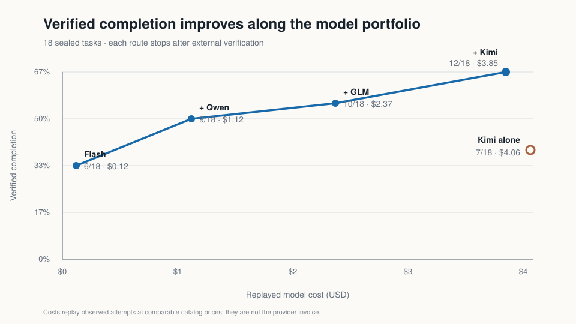

# Raising long-horizon agent completion with a model portfolio

## The result in 30 seconds

On **18 sealed Terminal-Bench Pro coding tasks**, the best single tested model
completed 7 tasks. A verifier-gated four-model cascade completed 12:

- **38.9% → 66.7% verified completion** (+27.8 percentage points);
- **5 additional completed tasks** without changing the tasks or verifiers;
- a two-model Flash → Qwen route completed 9 tasks at **72% lower replayed
  model cost** than always using Kimi; and
- every point on the cascade—Flash, Flash → Qwen, + GLM, + Kimi—occupied the
  observed completion-versus-cost Pareto frontier.



This supports a practical product claim: **a verified portfolio of models can
increase the empirical chance that a long-running agent finishes while giving
the operator an explicit cost frontier.** It does not prove that an agent can
guarantee success, or that a learned mid-run supervisor is ready.

## The product decision

A conventional router tries to choose the best model once, before work begins.
Long-horizon tasks make that brittle: model capability is jagged, failures are
only obvious after work has started, and an apparently stronger model is not
best on every task.

The supervisor therefore separates two decisions:

1. **Portfolio policy:** which complementary model should try next after an
   external verifier rejects the current result?
2. **Intervention policy:** when should the system preserve the live workspace
   and change course before the run exhausts its budget?

The first decision is supported by held-out evidence. The second is the current
research problem.

## How the held-out experiment worked

The evaluation used 18 tasks that were not used to choose the route order. Each
task was run independently through four frozen model routes, producing **72
learning-valid outcomes**. Prompts, model versions, tool limits, stopping logic,
and external verifiers were fixed before evaluation.

The policy starts with the least expensive route and stops only when the task's
external verifier confirms success. If verification fails, it restarts cleanly
on the next route.

| Policy | Verified tasks | Success rate | Replayed model cost |
|---|---:|---:|---:|
| Flash only | 6/18 | 33.3% | $0.1208 |
| Best single model: Kimi | 7/18 | 38.9% | $4.0559 |
| Flash → Qwen | 9/18 | 50.0% | $1.1187 |
| Flash → Qwen → GLM | 10/18 | 55.6% | $2.3749 |
| Flash → Qwen → GLM → Kimi | **12/18** | **66.7%** | **$3.8475** |

Ten tasks discriminated between routes: at least one model passed and another
failed. Six tasks defeated every tested model, which bounds any chooser over
these four observed clean-start outcomes at 12/18.

The exact provider spend for collecting this held-out panel was **$4.1006**.
The table uses replayed catalog prices for clean policy comparisons; it is not
the provider invoice.

## What the project learned

### Model quality is not a single ladder

The four-model cascade cost less than Kimi alone in replay while completing five
more tasks. Flash also uniquely covered work that other routes missed. The
right mental model is overlapping failure surfaces—“Swiss cheese”—rather than
small model → large model as a universal quality ordering.

### Verification creates the product loop

Routing only helps if the system knows when a task is actually complete. The
external verifier is therefore the stop signal; self-reported model confidence
is not. Completion is optimized first, then cost among policies with comparable
completion.

### Honest negative results are part of the artifact

A learned task-start router matched the fixed route order on the held-out set;
it did not improve it. A continuation-risk model barely improved calibration
over constant prevalence and had weak ranking performance. Earlier live
switching pilots were too sparse or inconclusive.

Those failures exposed the missing training data: historical trajectories show
what happened when one model continued, but not what would have happened if a
different action began from the **same intermediate state**. Manufacturing
switch labels from unrelated runs would create false counterfactuals.

## The supervisor interface

The reusable product boundary is deliberately small:

```text
agent harness → normalized observation → supervisor action → harness adapter
```

The observation contains only information available at decision time. The
action is one of: continue, switch with the current workspace, escalate
reasoning, restart cleanly, or stop after verified success. The harness adapter
owns terminals, sandboxes, model APIs, and state transfer, so adding a new model
does not require rebuilding the supervisor.

## Latest detector result

The latest frozen natural-continuation calibration produced 26 trajectories:
17 learning-valid and 9 structural failures. All 28 counted checkpoints
rehydrated exactly. Healthy checkpoints recovered 58.8% of the time, while the
single confirmed-stuck checkpoint recovered 0%; the gate still failed because
confirmed coverage was too sparse and task-dependent. Incremental provider
spend was $0.9829, and cleanup left no Daytona environments.

This is useful infrastructure and detector evidence, not an intervention
claim. See the [full v6 result](docs/continuation-calibration-v6-final.md).

## The next falsifiable milestone

The next experiment starts several branches from an identical saved workspace:

1. continue the current model;
2. switch to a complementary model with state preserved;
3. escalate to a stronger reasoning model; and
4. restart cleanly when that action is applicable.

Every branch runs to the same external verifier and records completion, tokens,
cost, duration, and state-transfer failures. Task-level splits prevent sibling
branches from leaking across training and evaluation.

Training begins only after the dataset contains at least **40 valid matched
groups across 20 tasks**, multiple actions win in meaningful numbers, and an
untouched validation split plus leakage audit is frozen. Until then, transparent
rules remain the appropriate baseline.

## Why this is a product project

The core work is not learning a particular sandbox, design tool, or API. Those
are replaceable and increasingly automatable. The durable skills demonstrated
here are:

- choosing a consequential AI decision rather than a convenient prediction;
- defining success with external evidence;
- designing counterfactual data that can support the intended action;
- distinguishing model failure from infrastructure failure;
- treating cost, latency, tokens, and completion as separate constraints; and
- refusing to train or ship when the evidence does not support the claim.

## Reproduce and inspect

- [Held-out methodology and complete scorecard](docs/gate8-wave3-18-task-final-scorecard.md)
- [Public machine-readable scorecard summary](docs/data/heldout-scorecard-summary-v0.json)
- [Replication study](docs/swiss-cheese-replication-v0-final.md)
- [First matched-state intervention pilot](docs/stuck-intervention-pilot-v0-final.md)
- [Why the current learned baselines are insufficient](docs/initial-supervisor-policy-v0.md)

All headline results above come from completed, versioned artifacts. The v6
detector result is included with its failed readiness gate; no intervention
policy has been trained or claimed.
