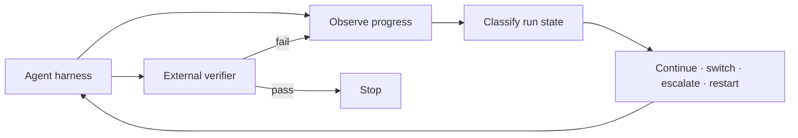

# Long-Horizon Supervisor

[](https://github.com/JacobEverly/long-horizon-supervisor/actions/workflows/ci.yml)

## Problem

Long-running coding agents fail unevenly. The most expensive model is not best
on every task, a model can spend many turns on an unproductive path, and model
self-assessment is not a reliable completion signal.

This project asks whether a harness-neutral supervisor can increase **verified
completion first**, then reduce cost and tokens among policies with comparable
success.

## Result

On 18 sealed Terminal-Bench Pro tasks, the best single tested model completed
7 tasks. A verifier-gated four-model portfolio completed 12 at a lower replayed
model cost:

| Policy | Verified completion | Replayed model cost |
|---|---:|---:|
| Best single model (Kimi) | 7/18 (38.9%) | $4.0559 |
| Flash → Qwen → GLM → Kimi | **12/18 (66.7%)** | **$3.8475** |


The portfolio gained five completions over the best single model. A cheaper
model also solved work that stronger models missed, supporting a “Swiss cheese”
view of capability: models have overlapping failure surfaces, not a universal
quality ordering.

This establishes the value of a verified clean-restart portfolio. It does
**not** establish that the current system can select the best intervention
during a live run.

## Approach

The supervisor observes a versioned, decision-time view of the run and emits a
small normalized action. Harness adapters own terminals, sandboxes, provider
APIs, and state transfer, so models and agent frameworks remain replaceable.



Mid-run intervention requires counterfactual evidence. From one saved workspace,
the experiment must compare continuing with switching, escalating, and restarting;
every branch must reach the same external verifier. Training waits until those
matched outcomes exist across enough independent tasks.

## Evidence status

| Claim | Evidence |
|---|---|
| Models provide complementary task coverage | Supported |
| A verifier-gated clean-start portfolio improves completion | Supported on held-out tasks |
| A learned task-start router improves the fixed order | Not supported |
| Confirmed-stuck states recover less often when left alone | Promising signal; v6 gate failed on sparse coverage |
| A learned live intervention policy is ready | Not yet |

Negative results are retained. Infrastructure failures are separated from model
failure, evaluation tasks never become training data, and policies are not tuned
on held-out outcomes.

## What this work demonstrates

- frozen, task-grouped evaluation with external verifiers;
- success-first cost and token Pareto analysis;
- portable workspace checkpoints with exact fidelity checks;
- matched-state counterfactual experiment design;
- leakage-controlled, provenance-rich training schemas; and
- product gates that stop training when evidence is insufficient.

## Read next

- [Two-minute case study](CASE_STUDY.md) — the held-out result and product
  interpretation.
- [Research program](docs/research-program.md) — experiments, negative results,
  and evidence in detail.
- [Continuation calibration v6](docs/continuation-calibration-v6-final.md) —
  the latest sealed detector result and its limits.
- [Roadmap](docs/roadmap.md) — the remaining gates before training.
- [Architecture](docs/architecture.md) — harness, supervisor, and state ownership.
- [Machine-readable scorecard](docs/data/heldout-scorecard-summary-v0.json) —
  public aggregate evidence.
- [Machine-readable v6 summary](docs/data/continuation-calibration-v6-summary.json)
  — credential-free detector result and gate status.

## Reproduce

Python 3.12 or newer is required. The local suite makes no paid model calls.

```bash
python -m venv .venv
source .venv/bin/activate
python -m pip install -e '.[dev,eval,training]'
pytest -q
```

Large benchmark fixtures, raw model trajectories, and credentials are excluded
from the public repository. Aggregate reports and project-authored tests remain
auditable from a clean clone.

## License

MIT. See [`LICENSE`](LICENSE).
