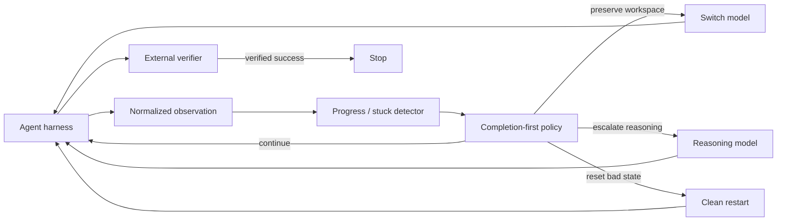

# Long-Horizon Supervisor

[](https://github.com/JacobEverly/long-horizon-supervisor/actions/workflows/ci.yml)

**Can an agent supervisor increase the chance that long-running coding tasks
finish—without paying frontier-model prices for every turn?**

This project is an evidence-first prototype for supervising long-horizon coding
agents. It watches a run, preserves external state, and decides whether to:

- continue with the current model;
- hand the same workspace to a complementary model;
- escalate to a stronger reasoning model; or
- restart cleanly after verification shows the current path is unproductive.

The product objective is **verified completion first, cost second**. Cost is
optimized among policies with comparable completion, rather than traded against
success through an arbitrary hidden score.

> **Research status:** model portfolios work; learned live intervention is not
> yet proven. A frozen confirmatory experiment exhausted its task pool with too
> few reproducible checkpoints and did not show a completion gain from live
> escalation over continuing.

## Why this exists

Long-running agents fail in different ways. A nominally stronger model is not
best on every task, and a cheaper model can solve work that a more expensive
model misses. That creates a “Swiss cheese” opportunity: overlap complementary
models so that one route covers another route's gaps.

A static cascade already exploits that complementarity. The harder and more
valuable question is whether we can intervene *during* a run—only when evidence
suggests that continuing is unlikely to work.



The supervisor is deliberately independent of any one agent framework. A
harness adapter owns terminals, sandboxes, and provider APIs; the policy sees a
small versioned observation and emits a normalized action.

## What the experiments show

### 1. A model portfolio raises completion

On 18 sealed held-out Terminal-Bench Pro tasks:

| Policy | Verified tasks | Replayed model cost |
|---|---:|---:|
| Best single model (Kimi) | 7/18 | $4.0559 |
| Flash only | 6/18 | $0.1208 |
| Flash → Qwen | 9/18 | $1.1187 |
| Flash → Qwen → GLM → Kimi | **12/18** | $3.8475 |

The completion-first cascade gained five tasks over the best single model. The
two-model Flash → Qwen cascade completed two more tasks than Kimi alone at 72%
lower replayed cost. Six tasks defeated every tested route, so routing among
these models could not exceed 12/18 on that panel.

See [`docs/gate8-wave3-18-task-final-scorecard.md`](docs/gate8-wave3-18-task-final-scorecard.md).

### 2. The complementarity repeats, but uncertainty remains

Across 20 confirmatory task-replication units, Flash → Qwen completed 13/20,
while two independent Flash attempts completed 6/20. The observed gain was 35
percentage points, but the task-clustered uncertainty interval still touched
zero. This is strong product evidence for a verifier-gated portfolio, not yet a
settled causal result.

A five-model clean-start cascade completed 16/20 units. A small 9B model added
no unique task coverage, but sometimes improved the dollar frontier by cheaply
solving work before expensive routes ran.

See [`docs/swiss-cheese-replication-v0-final.md`](docs/swiss-cheese-replication-v0-final.md).

### 3. Live stuck-state escalation remains unproven

In the first matched-state pilot, every intervention started from an identical
saved workspace:

| Action at four suspected-stuck states | Verified tasks |
|---|---:|
| Continue current model | 1/4 |
| Switch Flash ↔ Qwen with state | 0/4 |
| Switch to Kimi with state | **2/4** |
| Restart Kimi clean | 1/4 |

Kimi produced two unique rescues, suggesting that some stuck states need more
reasoning rather than merely a different model. The sample was too small and
had too few independent healthy controls to train or deploy a policy.

The confirmatory experiment froze the detector, task order, four matched
actions, budget, and analysis before inspecting new outcomes. Its 21-task pool
produced only 3 stuck and 3 healthy groups across 4 tasks. Continuing and Kimi
each completed 1/3 stuck groups, but they solved the same group, so Kimi had no
unique rescue over continuing. The proper result is **inconclusive** and no
learned intervention policy is justified.

See [`docs/stuck-confirmatory-v1-final.md`](docs/stuck-confirmatory-v1-final.md)
and [`docs/stuck-intervention-pilot-v0-final.md`](docs/stuck-intervention-pilot-v0-final.md).

### 4. The first learned baselines did not beat simple rules

- A development-only task-start router matched the fixed cascade but did not
  improve its order on held-out tasks.
- A continuation-risk estimator achieved only a tiny calibration improvement
  over constant prevalence and had weak discrimination.
- Existing logs observe what happened when a model continued; they do not
  contain valid counterfactual outcomes for switching at the same state.

That negative result shaped the current experiment: collect matched
interventions first, then train. We do not manufacture switch labels from
unrelated trajectories.

See [`docs/initial-supervisor-policy-v0.md`](docs/initial-supervisor-policy-v0.md).

## What is and is not established

| Claim | Status |
|---|---|
| Different models have complementary task coverage | **Supported** |
| A verifier-gated clean-start cascade improves completion | **Supported** |
| The best route is a universal quality ladder | **Rejected by observed jaggedness** |
| A small learned task-start router beats fixed order | **Not supported** |
| The current detector reliably recognizes stuck states | **Not supported by the confirmatory sample** |
| Kimi should always replace a stuck model | **Not supported** |
| A learned live supervisor is ready to deploy | **Not yet** |

## Architecture

The core contract is:

```text
observe → snapshot → decide → act → verify
```

- `models.py` defines harness-neutral events and state.
- `reducer.py` converts events into deterministic run state.
- `stuck_detector.py` implements the frozen, outcome-blind detector.
- `policy.py` applies completion and budget constraints.
- `recovery_policy.py` handles evidence-aware rollback and restart rules.
- `snapshot.py` defines portable workspace checkpoints.
- `benchmark/` integrates external verifiers, Harbor, Daytona, and NeMo
  Switchyard behind adapters.
- `training/` builds leakage-controlled datasets and frozen evaluators.

External process memory is not silently presented as preserved state. A switch
is eligible only when the workspace and any required service can be reproduced
from a public, frozen recipe.

## Run the local test suite

Python 3.12 or newer is required.

```bash
python -m venv .venv
source .venv/bin/activate
python -m pip install -e '.[dev,eval,training]'
pytest -q
```

The deterministic unit tests do not require paid provider credentials. Tests
whose sole purpose is validating the private experiment corpus skip when those
files are not present.

Paid experiments require separately configured, hard-capped OpenRouter and
Daytona credentials. Never run a paid gate without reading its frozen manifest
and budget first.

## Repository guide

Start here:

1. [`docs/primer-01-routing-experiments.md`](docs/primer-01-routing-experiments.md)
   — routing, matched experiments, and the cost/success frontier.
2. [`docs/architecture.md`](docs/architecture.md) — harness and state ownership.
3. [`docs/gate8-wave3-18-task-final-scorecard.md`](docs/gate8-wave3-18-task-final-scorecard.md)
   — sealed 18-task evaluation.
4. [`docs/swiss-cheese-replication-v0-final.md`](docs/swiss-cheese-replication-v0-final.md)
   — replicated model-complementarity study.
5. [`docs/stuck-intervention-pilot-v0-final.md`](docs/stuck-intervention-pilot-v0-final.md)
   — first matched-state intervention pilot.
6. [`docs/stuck-confirmatory-v1-final.md`](docs/stuck-confirmatory-v1-final.md)
   — frozen confirmatory result and coverage failure.
7. [`docs/initial-supervisor-policy-v0.md`](docs/initial-supervisor-policy-v0.md)
   — learned baselines and why they are not deployed.

Large downloaded datasets, third-party benchmark fixtures, raw model
trajectories, paid-run artifacts, and credentials are intentionally excluded
from the public repository. Small project-authored repair fixtures remain so the
core supervisor tests run from a clean clone. Corpus-dependent integrity tests
skip transparently when their private inputs are absent. The aggregate reports
retain the experimental decisions and enough detail to audit the claims without
publishing provider data or hidden benchmark material.

## Next milestone

The next milestone is a checkpoint-coverage feasibility gate, not model
training. On a fresh, outcome-blind task source, the project must first bank at
least 12 reproducible stuck and 12 reproducible healthy snapshots across at
least eight tasks. Only after that coverage exists should matched interventions
run. If adequate coverage cannot be produced, live switching should be
deprioritized in favor of the already-supported verifier-gated clean-start
cascade.

## License

MIT. See [`LICENSE`](LICENSE).
