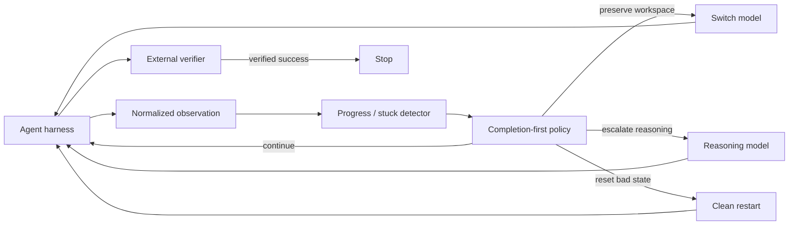

# Long-Horizon Supervisor

[](https://github.com/JacobEverly/long-horizon-supervisor/actions/workflows/ci.yml)

**Can an agent supervisor increase the chance that long-running coding tasks
finish—without paying frontier-model prices for every turn?**

This project is an evidence-first prototype for supervising long-horizon coding
agents. It watches a run, preserves external state, and decides whether to:

- continue with the current model;
- hand the same workspace to a complementary model;
- escalate to a stronger reasoning model; or
- restart cleanly after verification shows the current path is unproductive.

The product objective is **verified completion first, cost second**. Cost is
optimized among policies with comparable completion, rather than traded against
success through an arbitrary hidden score.

## Held-out result

On 18 sealed Terminal-Bench Pro tasks, the best single tested model completed
7 tasks. A verifier-gated four-model portfolio completed 12 while using a lower
replayed model cost than always using the best single model:

| Policy | Verified completion | Replayed model cost |
|---|---:|---:|
| Best single model (Kimi) | 7/18 (38.9%) | $4.0559 |
| Flash → Qwen → GLM → Kimi | **12/18 (66.7%)** | **$3.8475** |


The result supports a practical claim: complementary models plus external
verification can raise the observed probability that a long-running agent
finishes. It does not establish that the current system can predict the best
mid-run intervention. See the [two-minute case study](CASE_STUDY.md) for the
frozen methodology, negative results, and next falsifiable milestone.

> **Research status:** model portfolios work; learned live intervention is not
> yet proven. A 48-trajectory continuation calibration found a large,
> task-clustered recovery gap between healthy and confirmed-stuck states, but
> only two independent confirmed-stuck tasks. Training remains blocked on
> targeted checkpoint coverage rather than model implementation.

> **Reviewing this as a portfolio project?** Start with the
> [two-minute case study](CASE_STUDY.md): a frozen four-model cascade raised
> verified completion from **38.9% to 66.7%** on 18 sealed long-horizon tasks,
> and the negative results explain why live switching is not yet a product
> claim.

## Why this exists

Long-running agents fail in different ways. A nominally stronger model is not
best on every task, and a cheaper model can solve work that a more expensive
model misses. That creates a “Swiss cheese” opportunity: overlap complementary
models so that one route covers another route's gaps.

A static cascade already exploits that complementarity. The harder and more
valuable question is whether we can intervene *during* a run—only when evidence
suggests that continuing is unlikely to work.



The supervisor is deliberately independent of any one agent framework. A
harness adapter owns terminals, sandboxes, and provider APIs; the policy sees a
small versioned observation and emits a normalized action.

The point of the project is not proficiency with a particular sandbox, model
API, or design tool. Those are replaceable. The durable work is choosing a
valuable decision problem, defining what evidence would change the product,
separating model behavior from infrastructure failure, preventing leakage, and
refusing to train until the counterfactual data is credible.

## What the experiments show

### 1. A model portfolio raises completion

On 18 sealed held-out Terminal-Bench Pro tasks:

| Policy | Verified tasks | Replayed model cost |
|---|---:|---:|
| Best single model (Kimi) | 7/18 | $4.0559 |
| Flash only | 6/18 | $0.1208 |
| Flash → Qwen | 9/18 | $1.1187 |
| Flash → Qwen → GLM → Kimi | **12/18** | $3.8475 |

The completion-first cascade gained five tasks over the best single model. The
two-model Flash → Qwen cascade completed two more tasks than Kimi alone at 72%
lower replayed cost. Six tasks defeated every tested route, so routing among
these models could not exceed 12/18 on that panel.

See [`docs/gate8-wave3-18-task-final-scorecard.md`](docs/gate8-wave3-18-task-final-scorecard.md).

### 2. The complementarity repeats, but uncertainty remains

Across 20 confirmatory task-replication units, Flash → Qwen completed 13/20,
while two independent Flash attempts completed 6/20. The observed gain was 35
percentage points, but the task-clustered uncertainty interval still touched
zero. This is strong product evidence for a verifier-gated portfolio, not yet a
settled causal result.

A five-model clean-start cascade completed 16/20 units. A small 9B model added
no unique task coverage, but sometimes improved the dollar frontier by cheaply
solving work before expensive routes ran.

See [`docs/swiss-cheese-replication-v0-final.md`](docs/swiss-cheese-replication-v0-final.md).

### 3. Live stuck-state escalation remains unproven

In the first matched-state pilot, every intervention started from an identical
saved workspace:

| Action at four suspected-stuck states | Verified tasks |
|---|---:|
| Continue current model | 1/4 |
| Switch Flash ↔ Qwen with state | 0/4 |
| Switch to Kimi with state | **2/4** |
| Restart Kimi clean | 1/4 |

Kimi produced two unique rescues, suggesting that some stuck states need more
reasoning rather than merely a different model. The sample was too small and
had too few independent healthy controls to train or deploy a policy.

The confirmatory experiment froze the detector, task order, four matched
actions, budget, and analysis before inspecting new outcomes. Its 21-task pool
produced only 3 stuck and 3 healthy groups across 4 tasks. Continuing and Kimi
each completed 1/3 stuck groups, but they solved the same group, so Kimi had no
unique rescue over continuing. The proper result is **inconclusive** and no
learned intervention policy is justified.

See [`docs/stuck-confirmatory-v1-final.md`](docs/stuck-confirmatory-v1-final.md)
and [`docs/stuck-intervention-pilot-v0-final.md`](docs/stuck-intervention-pilot-v0-final.md).

### 4. Detector precision and checkpoint recall remain unresolved

Detector v1 stopped treating unchanged workspaces during normal inspection as
stuck. Across task-grouped development folds, its projected stuck checkpoints
had 23.5% continuation recovery versus 44.8% at healthy checkpoints—a 21.3
point difference whose task-clustered interval excluded zero.

But exact replay on the prior scouts found only 3 stuck hits with v1 versus 22
with v0. Total healthy-plus-stuck hits fell from 33 to 22. Because the frozen
gate required both better discrimination and better checkpoint yield, the
result is **NOT READY**. Task sourcing and paid collection were skipped.

See [`docs/checkpoint-coverage-v1-final.md`](docs/checkpoint-coverage-v1-final.md).

A subsequent two-tier detector separated broad `NEEDS_REVIEW` states from
stricter `CONFIRMED_STUCK` states. The confirmed projection recovered 25.0%
versus 44.8% for healthy checkpoints, but missed the frozen 20-point threshold
by 0.2 points and its uncertainty interval included zero. Exact replay produced
7 review checkpoints and no later confirmations because many historical scouts
stopped before a second-tier decision could occur. The gate again stopped at
$0.

See [`docs/two-tier-detector-v2-final.md`](docs/two-tier-detector-v2-final.md).

A live continuation-only calibration then ran both Flash and Qwen naturally on
24 preselected tasks. Among 48 trajectories, 18 were learning-valid and all 28
counted snapshots rehydrated successfully. Healthy checkpoints completed 43.8%
of the time, review checkpoints 30.0%, and confirmed-stuck checkpoints 0.0%.
The healthy-minus-confirmed gap was 43.8 points with a positive task-clustered
95% interval, and the direction was positive for both models.

The gate still failed correctly: only two confirmed-stuck checkpoints from two
tasks were observed, so the result cannot establish broad, task-independent
intervention value. The next collection should target fresh, statically
checkpoint-compatible hard tasks; it should not tune detector thresholds or fit
a model on the sparse stuck class.

See
[`docs/continuation-calibration-v3-final.md`](docs/continuation-calibration-v3-final.md).

A fresh 48-trajectory successor then filled the aggregate coverage deficit.
Across v3 and v4, confirmed-stuck checkpoints recovered 14.3% of the time
versus 47.9% for healthy controls, a 33.6-point gap with a task-clustered 95%
interval above zero. Both model-specific directions were positive.

V4 still failed correctly: two of 65 fresh checkpoint replays changed Git
object permission bits during safe archive extraction. The transport bug is
fixed, but the frozen result remains failed and cannot authorize intervention.
The next independent cohort changes only checkpoint transport and evaluation
provenance; it does not tune the detector on these outcomes.

See
[`docs/continuation-calibration-v4-final.md`](docs/continuation-calibration-v4-final.md).

### 5. The first learned baselines did not beat simple rules

- A development-only task-start router matched the fixed cascade but did not
  improve its order on held-out tasks.
- A continuation-risk estimator achieved only a tiny calibration improvement
  over constant prevalence and had weak discrimination.
- Existing logs observe what happened when a model continued; they do not
  contain valid counterfactual outcomes for switching at the same state.

That negative result shaped the current experiment: collect matched
interventions first, then train. We do not manufacture switch labels from
unrelated trajectories.

See [`docs/initial-supervisor-policy-v0.md`](docs/initial-supervisor-policy-v0.md).

## What is and is not established

| Claim | Status |
|---|---|
| Different models have complementary task coverage | **Supported** |
| A verifier-gated clean-start cascade improves completion | **Supported** |
| The best route is a universal quality ladder | **Rejected by observed jaggedness** |
| A small learned task-start router beats fixed order | **Not supported** |
| Repeated failures identify lower-recovery states | **Supported in development** |
| The current detector can populate a balanced checkpoint bank | **Not supported** |
| Historical stopped scouts can evaluate a two-tier transition | **Rejected** |
| Kimi should always replace a stuck model | **Not supported** |
| A learned live supervisor is ready to deploy | **Not yet** |

## Architecture

The core contract is:

```text
observe → snapshot → decide → act → verify
```

- `models.py` defines harness-neutral events and state.
- `reducer.py` converts events into deterministic run state.
- `stuck_detector.py` implements the frozen, outcome-blind detector.
- `policy.py` applies completion and budget constraints.
- `recovery_policy.py` handles evidence-aware rollback and restart rules.
- `snapshot.py` defines portable workspace checkpoints.
- `benchmark/` integrates external verifiers, Harbor, Daytona, and NeMo
  Switchyard behind adapters.
- `training/` builds leakage-controlled datasets and frozen evaluators.

External process memory is not silently presented as preserved state. A switch
is eligible only when the workspace and any required service can be reproduced
from a public, frozen recipe.

## Run the local test suite

Python 3.12 or newer is required.

```bash
python -m venv .venv
source .venv/bin/activate
python -m pip install -e '.[dev,eval,training]'
pytest -q
```

The deterministic unit tests do not require paid provider credentials. Tests
whose sole purpose is validating the private experiment corpus skip when those
files are not present.

Paid experiments require separately configured, hard-capped OpenRouter and
Daytona credentials. Never run a paid gate without reading its frozen manifest
and budget first.

## Repository guide

Start here:

1. [`docs/primer-01-routing-experiments.md`](docs/primer-01-routing-experiments.md)
   — routing, matched experiments, and the cost/success frontier.
2. [`docs/architecture.md`](docs/architecture.md) — harness and state ownership.
3. [`docs/gate8-wave3-18-task-final-scorecard.md`](docs/gate8-wave3-18-task-final-scorecard.md)
   — sealed 18-task evaluation.
4. [`docs/swiss-cheese-replication-v0-final.md`](docs/swiss-cheese-replication-v0-final.md)
   — replicated model-complementarity study.
5. [`docs/stuck-intervention-pilot-v0-final.md`](docs/stuck-intervention-pilot-v0-final.md)
   — first matched-state intervention pilot.
6. [`docs/stuck-confirmatory-v1-final.md`](docs/stuck-confirmatory-v1-final.md)
   — frozen confirmatory result and coverage failure.
7. [`docs/initial-supervisor-policy-v0.md`](docs/initial-supervisor-policy-v0.md)
   — learned baselines and why they are not deployed.
8. [`docs/checkpoint-coverage-v1-final.md`](docs/checkpoint-coverage-v1-final.md)
   — detector v1's offline separation, coverage failure, and zero-spend stop.
9. [`docs/two-tier-detector-v2-final.md`](docs/two-tier-detector-v2-final.md)
   — frozen two-tier detector result and the missing continuation evidence.
10. [`docs/continuation-calibration-v3-final.md`](docs/continuation-calibration-v3-final.md)
    — 48-trajectory live calibration, positive recovery separation, and the
    remaining confirmed-stuck coverage blocker.
11. [`docs/continuation-calibration-v4-final.md`](docs/continuation-calibration-v4-final.md)
    — 96-trajectory aggregate calibration, a positive detector result, and the
    exact checkpoint-fidelity failure that blocks intervention.

Large downloaded datasets, third-party benchmark fixtures, raw model
trajectories, paid-run artifacts, and credentials are intentionally excluded
from the public repository. Small project-authored repair fixtures remain so the
core supervisor tests run from a clean clone. Corpus-dependent integrity tests
skip transparently when their private inputs are absent. The aggregate reports
retain the experimental decisions and enough detail to audit the claims without
publishing provider data or hidden benchmark material.

## Next milestone

Freeze a fresh, outcome-blind collection focused on statically
checkpoint-compatible hard tasks. Its purpose is narrow: add enough independent
`CONFIRMED_STUCK` states to test whether the positive recovery gap survives
across tasks and both models. Only after the continuation-calibration gate
passes should those frozen states be branched into matched continue, switch,
escalate, and clean-restart interventions. Training still waits for those
matched counterfactual labels.

## License

MIT. See [`LICENSE`](LICENSE).
