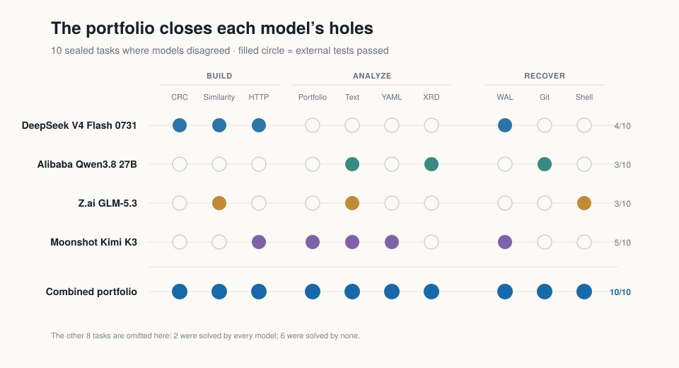
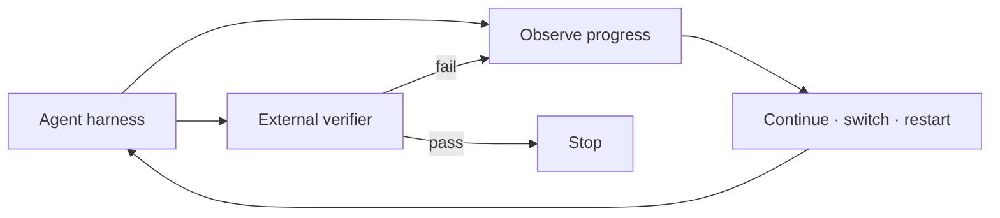

# Long-Horizon Agent Reliability

[](https://github.com/JacobEverly/long-horizon-supervisor/actions/workflows/ci.yml)

Experiments and open tooling for helping long-running coding agents finish more
often and be more cost efficient

## The problem

Long-running agents fail unevenly. The most expensive model is not best on every
task, models can spend many turns on a bad path, and their own claims of success
are unreliable.

This project studies two questions:

1. Can complementary models improve verified completion?
2. Can we learn when a live run should continue, switch models, or restart?

## What we found

Across the broader research program, we recorded nearly 200 hours of agent
execution. The headline result below uses a sealed 72-run evaluation: four
models on 18 Terminal-Bench Pro tasks. The best single model completed 7 tasks;
a fixed portfolio that tried complementary models in sequence completed 12.

| Policy | Tasks completed | Replayed model cost |
|---|---:|---:|
| Best single model (Kimi) | 7/18 (38.9%) | $4.0559 |
| Flash → Qwen → GLM → Kimi | **12/18 (66.7%)** | **$3.8475** |


The portfolio added five completions while costing slightly less in replay.
Smaller models also solved work that stronger models missed. Model capability
looks less like a ladder and more like Swiss cheese: each model covers different
failure surfaces.



This result supports a **verified clean-start model portfolio**. It does not yet
show that switching models during a live run improves success.

## What is here

- a harness-neutral observation and action interface;
- external verification and success-first cost analysis;
- checkpoint, replay, fidelity, and cleanup tooling;
- frozen evaluation contracts and credential-free aggregate results; and
- negative results that define what evidence is still missing.



## What comes next

The open question is intervention timing. A credible test must branch the same
saved workspace into several futures: continue the current model, preserve state
and switch, escalate reasoning, or restart cleanly. Every branch must reach the
same verifier.

We will train an intervention policy only after collecting at least 40 valid
matched groups across 20 tasks, freezing a task-level validation split, and
passing leakage and data-integrity checks. Until then, the fixed portfolio is the
supported result and the learned supervisor remains future work.

## Data and reproduction

The repository includes
[715 credential-redacted agent trajectories](docs/data/public-agent-traces-v0.jsonl.gz)
representing 172 hours of execution, alongside the aggregate scorecards. The
archive contains successful, failed, interrupted, and infrastructure-affected
runs; it is a research record, not 715 training-valid examples. See the
[data card](docs/data/README.md) for provenance, schema, and limitations.

```bash
python -m venv .venv
source .venv/bin/activate
python -m pip install -e '.[dev,eval,training]'
pytest -q
```

For more detail, read the [case study](CASE_STUDY.md), [research record](docs/research-program.md),
[architecture](docs/architecture.md), and [roadmap](docs/roadmap.md).

## License

Code is MIT licensed. Dataset components retain their source-specific terms; see
the data card before reuse.
